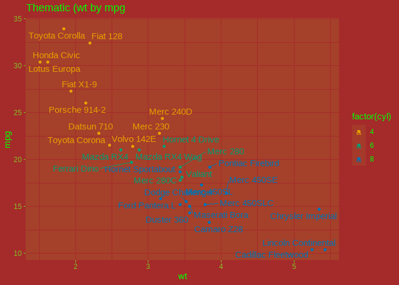
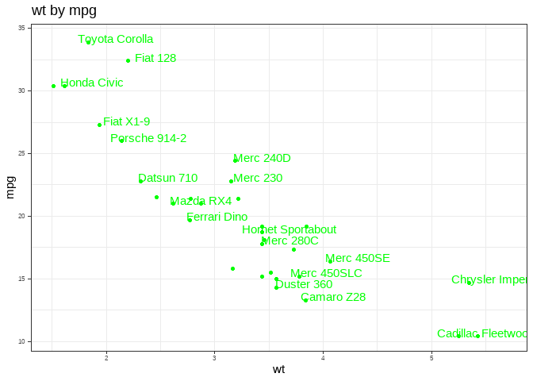
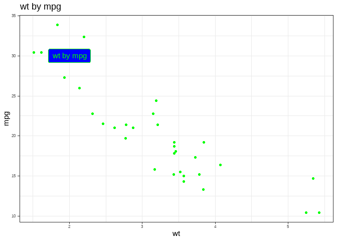
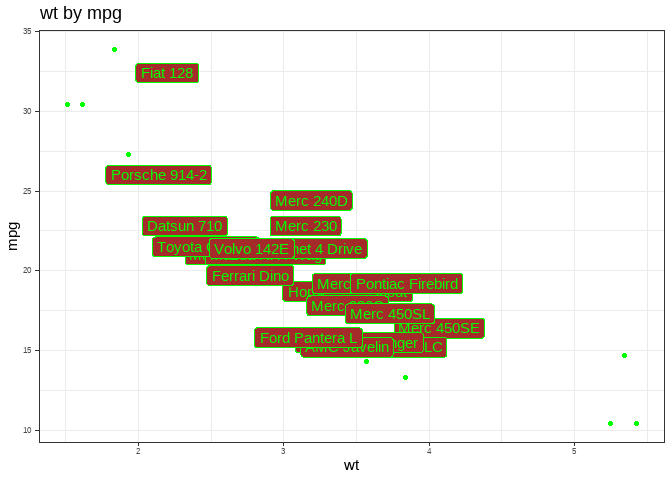
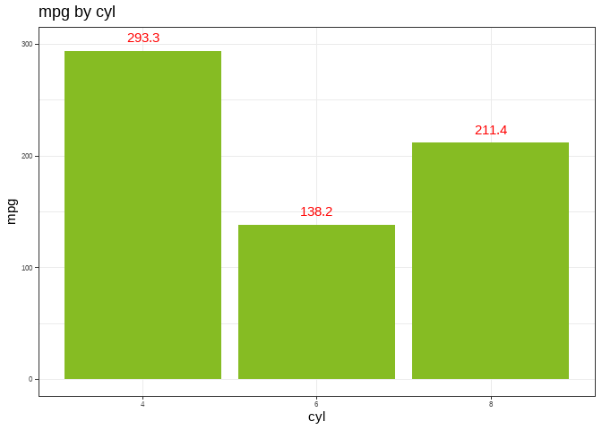
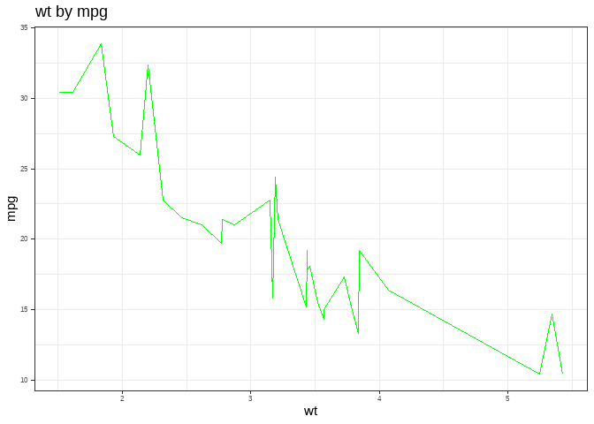

Happy_Project
================
Moses
2022-05-04

## Column

### Chart 1

``` r
thematic::thematic_on(bg = "brown", 
                      fg = "green", 
                      accent = "blue", 
                      font = "red")


ggplot(mtcars, aes(wt, mpg, 
            label = rownames(mtcars), 
            color = factor(cyl))) +
  geom_point() +
  ggrepel::geom_text_repel()+
    labs (title = "Thematic (wt by mpg", 
        x = "wt", 
        y = "mpg")
```

    ## Warning: The font family 'red' doesn't appear to be available as a Google Font.
    ## Try manually downloading and installing it on your system. For more info, visit
    ## https://github.com/rstudio/thematic#fonts

    ## Warning: It seems the current graphics device 'png' is unable to render the
    ## requested font family ''. To render custom fonts, either use a ragg device or
    ## install the showtext package

    ## Warning: ggrepel: 1 unlabeled data points (too many overlaps). Consider
    ## increasing max.overlaps

<!-- -->

## Results

### Chart 2

``` r
ggplot(mtcars, aes(x=wt, y=mpg)) +
  geom_point() + 
  geom_text(
    label=rownames(mtcars), 
    nudge_x = 0.25, nudge_y = 0.25, 
    check_overlap = T
  )+
  theme_bw()+
    labs (title = "wt by mpg", 
        x = "wt", 
        y = "mpg")
```

<!-- -->

### Chart 3

``` r
ggplot(mtcars, aes(x=wt, y=mpg)) +
  geom_point() + 
  theme_bw()+
  labs (title = "wt by mpg", 
        x = "wt", 
        y = "mpg")+
  geom_label(
    label="wt by mpg", 
    x = 2,
    y =30,
    label.padding = unit(0.44, "lines"), 
    label.size = 0.25,
    color = "green",
    fill="blue")
```

<!-- -->

### Chart 4

``` r
cars <- mtcars |> 
  rownames_to_column(var="carName") 

ggplot(cars, aes(x=wt, y=mpg)) +
  theme_bw()+
  geom_point() + 
  labs (title = "wt by mpg", 
        x = "wt", 
        y = "mpg")+
  geom_label( 
    data=cars |>  
      filter(mpg>15 & wt>2), 
    aes(label=carName))
```

<!-- -->

### Chart 6

``` r
tmp <- mtcars  |>  
  group_by(cyl) |>  
  summarise(tot_mpg = sum(mpg))

  tmp$cyl <- factor(tmp$cyl)

ggplot(mtcars) +
  geom_col(aes(x = reorder(factor(cyl), -mpg), y = mpg)) +
  geom_text(data = tmp, color = "red",
            aes(x = cyl, y = tot_mpg, label = tot_mpg), 
            vjust = -1) +
  #theme(legend.position="bottom")+  
  theme(axis.title.y = element_blank())+
    #theme(axis.title.x = element_blank()) 
  ylim(0, 300)+
  labs (title = "mpg by cyl", 
        x = "cyl", 
        y = "mpg") +
  theme_bw() 
```

<!-- -->

### Chart 6

``` r
ggplot(mtcars,aes(x=wt,y=mpg))+
  geom_line()+
  theme_bw()+
labs (title = "wt by mpg", 
        x = "wt", 
        y = "mpg")
```

<!-- -->
